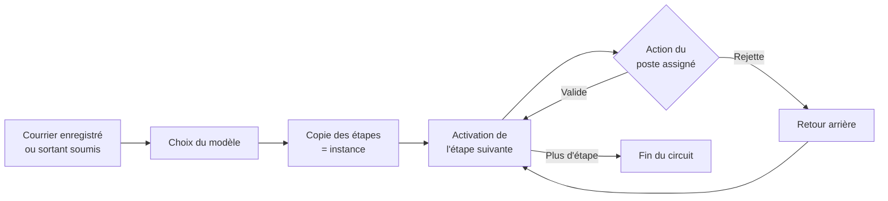

# Les circuits de traitement du courrier

*Fonctionnement et impact des modifications — état du code au 23/09/2026*

## 1. En bref

Un **circuit** est la suite ordonnée des étapes par lesquelles passe un courrier, de son arrivée à sa clôture. Chaque étape dit **quoi faire** (imputer, traiter, viser, signer…), **qui doit le faire** et **en combien de jours**.

L'administrateur définit des **modèles de circuit** dans `/admin/circuits`. Quand un courrier démarre son parcours, l'application choisit le bon modèle et en fait une **copie propre à ce courrier** (l'« instance »). C'est cette copie qui avance, étape par étape.

> **Conséquence clé :** modifier un modèle ne change que les **prochains** courriers. Ceux déjà en circulation gardent les étapes qu'ils avaient au départ.

---

## 2. Les notions

| Notion | Ce que c'est | Exemple |
|---|---|---|
| **Modèle de circuit** | Le « gabarit » défini par l'admin : un sens, des types de courrier, une liste d'étapes. | « Facture fournisseur » |
| **Sens** | Entrant (reçu) ou sortant (émis). Un modèle ne sert qu'à un sens. | ENTRANT |
| **Types de courrier** | Les types auxquels le modèle s'applique. Liste vide = **modèle par défaut** du sens. | `FACTURE` |
| **Étape** | Une action à faire, dans un ordre donné. | « Visa du DAF » |
| **Type d'étape** | La nature de l'action (voir tableau ci-dessous). | VISA |
| **Cible** | Qui fait l'étape : un **poste précis** ou un **rôle** calculé selon le courrier. | Poste « DAF » ou rôle « Responsable de l'entité traitante » |
| **Délai (jours)** | Temps accordé à l'étape. Sert à calculer l'échéance. | 2 j |
| **Saut automatique** | Case « saut auto » : l'étape est ignorée si elle ferait valider quelqu'un par lui-même. | Voir §4.4 |
| **Instance de circuit** | La copie du modèle attachée à un courrier précis, qui garde l'historique de chaque étape. | Circuit de la facture ARR-2026-000031 |

### Les types d'étape

| Type | Action attendue | Bouton dans l'appli | Rejet possible ? |
|---|---|---|---|
| **IMPUTATION** | Choisir l'entité qui va traiter le courrier. | Imputer | Non |
| **TRAITEMENT** | Traiter le dossier (et rédiger la réponse si besoin). | Marquer comme traité | Non |
| **VISA** | Donner un avis favorable. | Viser / Rejeter | Oui |
| **VALIDATION** | Valider le travail. | Valider / Rejeter | Oui |
| **SIGNATURE** | Signer le document (parapheur). | Signer (parapheur) | Oui |
| **EXPEDITION** | Envoyer le courrier signé. | Expédier | Oui |

### Les cibles possibles

| Cible | Qui est désigné, concrètement |
|---|---|
| **Poste précis** | Toujours ce poste, quel que soit le courrier (ex. : Secrétaire général pour l'imputation). |
| **Bureau d'ordre** | Un agent du bureau d'ordre (à défaut, son chef). |
| **Rédacteur** | Le poste de la personne qui a créé le courrier. |
| **Responsable de l'entité traitante** | Le poste responsable de l'entité à qui le courrier a été imputé (ex. : Chef comptabilité). |
| **Directeur de l'entité traitante** | Le responsable de la **direction** au-dessus de l'entité traitante (ex. : DAF pour la comptabilité). |

> Les rôles « entité traitante » ne fonctionnent qu'**après l'imputation**. Placés avant, ils provoquent l'erreur « imputation manquante ».

---

## 3. Les 4 circuits livrés dans la démo

| Circuit | Sens | S'applique à | Étapes (délai) |
|---|---|---|---|
| **Entrant standard** | Entrant | Tous les types sans circuit dédié | Imputation par le SG (1 j) → Traitement par le responsable de l'entité (5 j) → Validation du directeur (2 j, saut auto) |
| **Facture fournisseur** | Entrant | FACTURE | Imputation SG (1 j) → Contrôle comptable (3 j) → Visa du DAF (2 j, saut auto) |
| **Réclamation** | Entrant | RECLAMATION | Imputation SG (1 j) → Traitement (3 j) → Validation du directeur (2 j, saut auto) |
| **Sortant standard** | Sortant | Tous les sortants | Visa du chef de service (2 j, saut auto) → Validation du directeur (2 j, saut auto) → Signature du DG (2 j) → Expédition par le bureau d'ordre (1 j) |

---

## 4. Comment ça marche

### 4.1 Vue d'ensemble

### 4.2 Choix du modèle

Quand un **entrant est enregistré** ou qu'un **sortant est soumis**, l'application cherche, parmi les modèles **actifs** du même sens :

1. un modèle dont la liste de types contient le type du courrier (ex. : FACTURE → « Facture fournisseur ») ;
2. sinon, le modèle **par défaut** (liste de types vide) ;
3. sinon, **erreur « aucun modèle de circuit »** : le courrier ne peut pas démarrer.

### 4.3 Activation d'une étape

À chaque étape qui démarre, l'application :

1. **résout la cible** : elle calcule quel poste est concerné, **à ce moment-là**, d'après l'organigramme actuel ;
2. vérifie le **saut automatique** (voir 4.4) ;
3. calcule l'**échéance** = date de début + délai en jours ;
4. met à jour le **statut** du courrier (En traitement, En validation…) ;
5. envoie une **notification « Nouvelle tâche »** au poste. Le courrier apparaît dans sa corbeille (ou son parapheur pour une signature).

Seul le **poste assigné** peut agir sur l'étape. Toute autre personne reçoit l'erreur « poste non assigné ».

### 4.4 Saut automatique

Une étape **VISA** ou **VALIDATION** cochée « saut auto » est ignorée si le poste qu'elle désigne est :

- le poste du **rédacteur** (courrier sortant), ou
- le même poste que celui de l'**étape précédente**.

But : éviter qu'une personne se valide elle-même. L'étape apparaît « ignorée » dans le parcours et le journal d'audit.

*Exemple :* le DAF rédige une réponse. « Visa du chef de service » et « Validation du directeur » désignent tous deux le DAF, donc les deux sont sautées. La réponse va directement au parapheur du DG.

### 4.5 Délais, rappels et escalade

Vérifiés au démarrage, puis toutes les 60 s et après chaque saut d'horloge de la démo :

| Situation | Effet |
|---|---|
| Échéance dans moins de 24 h | Notification **Rappel** au poste assigné |
| Échéance dépassée | Notification **Retard** au poste assigné |
| Retard ≥ délai d'escalade (2 j par défaut, réglable dans Personnalisation) | Notification **Escalade** au supérieur hiérarchique, une seule fois par étape |

Chaque notification n'est créée qu'une fois, même si la vérification se répète.

### 4.6 Rejet

Le rejet exige un **motif**. Il est impossible sur une étape d'imputation ou de traitement.

| Sens | Ce qui se passe |
|---|---|
| **Entrant** | Le circuit **revient à l'étape TRAITEMENT**. Cette étape et toutes les suivantes repartent à zéro. Le motif reste visible sur l'étape rejetée. |
| **Sortant** | Le circuit s'arrête. Le courrier passe **Rejeté** et le rédacteur est notifié. Il dépose une nouvelle version et **resoumet**, ce qui démarre un **nouveau circuit complet** (anciennes versions conservées). |

### 4.7 Fin du circuit

| Sens | Fin |
|---|---|
| **Entrant** | Dernière étape validée. Si aucune réponse n'est attendue : **Clôturé**. Si une réponse est attendue et pas encore expédiée : **En attente de réponse**, puis **Clôturé** automatiquement quand la réponse est expédiée. |
| **Sortant** | Après la signature, le courrier est **Signé**. L'expédition le passe **Expédié** (numéro DEP-…) et clôture l'entrant auquel il répond. |

### 4.8 Exemple déroulé : une facture

| # | Étape | Qui | Résultat |
|---|---|---|---|
| 1 | Enregistrement | Carine (bureau d'ordre) | Type FACTURE → modèle « Facture fournisseur ». Tâche d'imputation chez le SG. |
| 2 | Imputation | Aïcha (SG) | Choisit « Service comptabilité ». L'entité traitante est connue. |
| 3 | Contrôle comptable | Grâce (chef comptabilité, calculée comme responsable de l'entité) | Marque comme traité. |
| 4 | Visa du DAF | Samuel (DAF, poste précis) | Rejette avec motif → retour à l'étape 3 chez Grâce. |
| 5 | Contrôle comptable (bis) | Grâce | Traite à nouveau. |
| 6 | Visa du DAF (bis) | Samuel | Vise → fin du circuit → **Clôturé**. |

### 4.9 Note et tâche confiée (hors circuit)

Le **titulaire de l'étape en cours** peut, à tout moment, écrire une note et **confier le travail** à un autre poste, par exemple le DG qui demande à son assistante de préparer une synthèse. Le bouton est **« Confier à… »**, dans le bloc « Notes et tâches confiées » de la fiche du courrier.

| Qui | Ce qui se passe |
|---|---|
| **Titulaire** (ex. DG) | Choisit un poste, écrit la note, fixe un délai s'il le souhaite. **L'étape reste la sienne.** Il ne peut ni la valider, ni la rejeter, ni signer tant que la tâche attend son compte rendu, sauf s'il **reprend la main** (annule la tâche). |
| **Destinataire** (ex. assistante de direction) | Reçoit une notification. La tâche apparaît en tête de sa **corbeille** (« Tâches qui vous ont été confiées »). Il accède au courrier, **même confidentiel**, fait le travail, puis **rend compte** (texte et fichier joint si besoin). |
| **Retour** | Le titulaire est notifié et voit le compte rendu sur la fiche. Il valide ou signe son étape, et le circuit continue normalement. |

Plusieurs tâches peuvent être confiées successivement sur une même étape. Tout est tracé dans le journal d'audit (TACHE_CONFIEE, COMPTE_RENDU, TACHE_ANNULEE). Seul le titulaire de l'étape peut confier ; les autres utilisateurs gardent le commentaire simple.

---

## 5. Les règles de l'éditeur de circuits

Dans `/admin/circuits`, on peut **réordonner** (flèches), **modifier** (libellé, type, cible, délai, saut auto), **ajouter**, **supprimer** des étapes, et **activer / désactiver** un modèle.

À l'enregistrement, le circuit est refusé si :

- il n'a **aucune étape** ;
- c'est un **entrant** qui ne **commence pas par une Imputation** ;
- c'est un **sortant** sans étape **Signature** ou qui ne **se termine pas par Expédition** ;
- une étape n'a **ni poste ni rôle** cible.

On **ne peut pas**, depuis l'écran : créer un nouveau modèle, le renommer, changer son sens ou ses types de courrier.

---

## 6. Impact d'une modification

| Modification | Courriers déjà en circulation | Nouveaux courriers |
|---|---|---|
| Ajouter / supprimer / réordonner une étape | **Aucun effet** (ils gardent leur copie) | Nouveau parcours |
| Changer un délai | **Aucun effet** sur les échéances déjà calculées | Nouveau délai |
| Changer une cible ou le saut auto | **Aucun effet** | Nouvelle cible |
| **Désactiver un modèle spécifique** (ex. Facture) | Aucun effet | Les factures basculent sur le **modèle par défaut** du sens |
| **Désactiver le modèle par défaut** | Aucun effet | Tout courrier sans modèle dédié **ne peut plus être enregistré ou soumis** (erreur) |
| **Resoumettre un sortant rejeté** | — | Repart avec le modèle **tel qu'il est aujourd'hui** |

### Ce qui, en revanche, touche les courriers en cours : l'organigramme

La cible d'une étape est calculée **au moment où l'étape démarre**, d'après l'organigramme **du moment**. Donc :

- changer le **responsable** d'une entité, désactiver un **poste** ou changer l'**entité** d'un poste modifie qui recevra les **prochaines étapes** des courriers déjà en route ;
- une étape **déjà active** reste chez le poste qui l'a reçue ;
- si aucun poste ne correspond (entité sans responsable actif, pas de bureau d'ordre actif…), l'étape ne peut pas démarrer et l'action précédente échoue avec une erreur (« responsable introuvable », etc.).

### Précautions avant de modifier

1. Garder **toujours un modèle par défaut actif** pour chaque sens.
2. Dans un circuit entrant, garder **une étape TRAITEMENT** : le rejet d'un entrant y revient. Sans elle, un rejet provoque une erreur (l'éditeur ne le vérifie pas aujourd'hui).
3. Ne pas placer d'étape ciblant l'**entité traitante** avant l'imputation.
4. Vérifier que chaque entité a un **poste responsable actif**, et la direction un directeur, avant de retirer des postes.

---

## 7. Limites actuelles et pistes

| Limite | Piste |
|---|---|
| Pas de création, renommage ni choix des types de courrier depuis l'écran | Ajouter « Nouveau circuit » et l'édition de l'en-tête du modèle |
| L'éditeur n'impose pas d'étape TRAITEMENT dans un entrant | Ajouter cette règle à la validation |
| Rien n'empêche de désactiver le dernier modèle par défaut | Bloquer ou avertir |
| Pas d'étapes en parallèle ni de conditions (montant, priorité…) | Hors périmètre du POC |
| Pas de versionnage visible des modèles | Afficher sur chaque courrier la version du modèle utilisée |

*Sources dans le code :* moteur `src/services/workflow.ts` (choix du modèle, activation, saut, rejet, fin), tâches confiées `src/services/taches.ts`, délais `src/services/notifications.ts`, éditeur `src/pages/admin/Circuits.tsx`, données de démo `src/db/seed.ts`.
